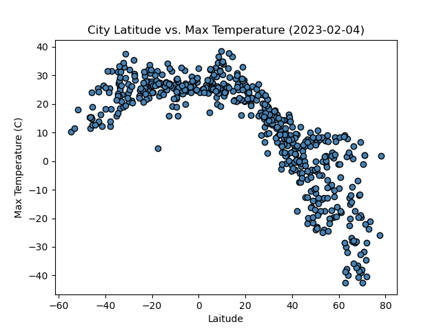

# python-api-challenge
## Background
What is the weather like as we approach the equator?

## WeatherPy

I created a Python script to visualixe the weather of over 500 cities of varying distances from the equator. To accomplish this I used [citipy Python library](https://pypi.org/project/citipy/),[OpenWeatherMap API](https://openweathermap.org/api) and used Jupyter Notebook for coding.

## Observation

* Warmest temperature is found at 0 latitude as the latitude increases or decreases, temperature drops.

* There is no strong relationship between latitude and cloudiness.

* There is no strong relationship between latitude and wind speed.

## Result

Created series of scatter plots to showcase the following relationships:

* Temperature vs Latitude

    

* Humidity (%) vs. Latitude

    

* Cloudiness (%) vs. Latitude

    

* Wind Speed (mph) vs. Latitude

    

For second observation I created series of Linear Regression for Each Relationship.

* Northern Hemisphere: Temperature vs. Latitude

 
The r-value is: 0.7461131115677967. There is a strong negetive correlation between latitude and max temperature for northern hemisphere.

* Southern Hemisphere: Temperature vs. Latitude

 

The r-value is: 0.17452773129110766. There is a moderate positive correlation between latitude and max temperature for southern hemishpere.

* Northern Hemisphere: Humidity vs. Latitude

 

The r-value is: 0.2681118153052088. There is a moderate positive correlation between latitude and humidity for northern hemishere.

* Southern Hemisphere: Humidity vs. Latitude

 

The r-value is: 0.07736761312032986. There is a moderate positive correlation between latitude and humidity for southern hemisphere.

* Northern Hemisphere: Cloudiness vs. Latitude

 

The r-value is: 0.10244489856746593. here is a weak positive correlation between latitude and cloudiness for northern hemisphere.

* Southern Hemisphere: Cloudiness vs. Latitude

 

The r-value is: 0.17457487826532345. There is a weak positive correlation between latitude and cloudiness for southern hemisphere.

* Northern Hemisphere: Wind Speed vs. Latitude

 

The r-value is: 0.0009858854040928964.There is a very weak positive correlation between latitude and windspeed for northern hemisphere.

* Southern Hemisphere: Wind Speed vs. Latitude

 

The r-value is: 0.07447587262094538. There is a very weak negative correlation between latitude and windspeed for southern hemisphere.

## VacationPy

I used my skills in working with weather data to plan future vacations. I used Jupyter notebook, the geoViews Python library, and the Geoapify API. 

* Narrow down my DataFrame to find my ideal weather condition.
  * For example:
    * A max temperature lower than 27 degrees but higher than 21
    * Wind speed less than 4.5 m/s
    * Zero cloudiness

Image of the humidity in each city

    
       

